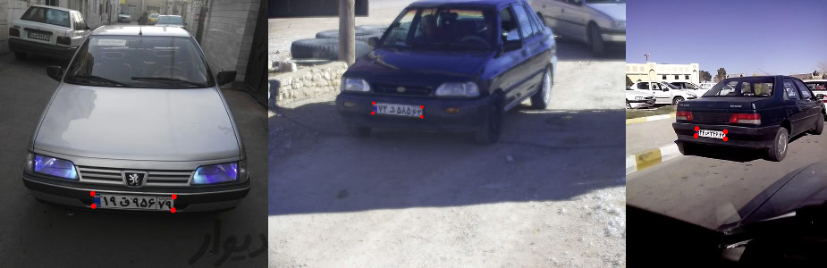

# Iranian Car Plate Corner Detection Dataset


This dataset contains **1,883 manually annotated images** of Iranian vehicles, each labeled with the **4 corner points of the license plate**. It is designed to support machine learning tasks such as:

- License plate detection and localization
- Perspective transformation and rectification
- Preprocessing for license plate recognition (LPR)
- Supervised learning for keypoint regression

This dataset was created as part of an educational project in the *Fundamentals of Computer Vision* course at **K. N. Toosi University of Technology**, Spring 2024.  
Course website: [wp.kntu.ac.ir/nasihatkon/teaching/cvug/s2024](https://wp.kntu.ac.ir/nasihatkon/teaching/cvug/s2024)

## 📦 Dataset Structure

```
./
├── images/                # 1,883 car images with visible Iranian license plates
├── annotations.csv        # CSV file with normalized corner coordinates
```

### 📋 Annotation Format

The `annotations.csv` file contains 1,883 rows. Each row corresponds to one image and includes the image name followed by the normalized coordinates of the four corner points of the license plate:

| image        | x1   | y1   | x2   | y2   | x3   | y3   | x4   | y4   |
|--------------|------|------|------|------|------|------|------|------|
| img_0001.jpg | 0.23 | 0.34 | 0.52 | 0.34 | 0.52 | 0.41 | 0.23 | 0.41 |

- All coordinates are **normalized** (i.e., values between 0 and 1).
- The order of points is **clockwise**, starting from the **top-left** corner of the license plate.

## 🧷 Data Collection Process

- Source images are selected from the open-source [IR-LPR dataset](https://github.com/mut-deep/IR-LPR) (GPLv3 license).
- A subset of 1,883 images was selected.
- Manual annotation of four license plate corners per image was performed by students.
- Annotation was conducted using [Label Studio](https://labelstud.io/) in a team-supervised environment.
- All annotations were verified by teaching assitant team for accuracy and consistency.

## 📥 Download

- [🤗 Hugging Face](#)  
- [📎 Kaggle](#)
- [📎 Google Drive](https://drive.google.com/file/d/1SMejgERlzYlrdL0ZO-5-H2RnT8rrA5s8/view?usp=sharing)  
